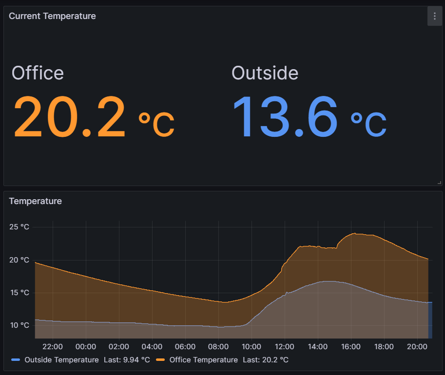
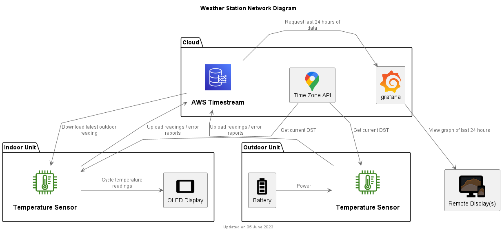

# Weatherstation

This project was born out of a desire to compare the indoor temperature of my home office with the outside temperature over the course of a 24 hour period. This data would provide a way of evaluating the effectiveness of the insulation used in the construction of the home office. This high level goal led to the following requirements:

## Requirements

  * Two separate temperature sensors which can be located independent of each other and not require any physical connection between the two.
  * Ability to view the data from any location on any internet connected device with a web browser such as a mobile phone, laptop, etc.
  * Full control and ownership of the data collected.
  * No ongoing fees to store or access the data.
  * Ability to graph the indoor and outdoor temperature readings over a 24 hour period in a way that is easy to compare the different rates of change and minimum and maximum readings.

These requirements led to the following design:

## Design

  * Use of a Raspberry Pi Pico W running MicroPython, coupled with a BME280 Atmospheric Sensor.
  * Use of a SSD1306 OLED display for displaying the current indoor and outdoor temperature on the indoor unit.
  * Use of a 2000Ah LiPo battery to power the outdoor sensor.
  * Periodic (e.g. every 60 seconds) reading of the sensor and upload to AWS Timestream for storage of time-series data in the cloud.
  * Periodic (e.g. every 60 seconds) download of the latest outdoor sensor reading from AWS Timestream for display on the indoor display.
  * Use of a NTP time server to retrieve the current time and set the Pico's real time clock.
  * Use a GCP timezone server to automatically calculate the local time, adjusting for daylight saving.
  * Enter 'deepsleep' mode between readings to conserve battery power for the outdoor sensor.
  * Periodic cycling (every 5 secods) of the indoor display to alternatively show the indoor temperature and the outdoor temperature.
  * Graphing of the latest 24 hour period of the indoor and outdoor temperature readings using Grafana Cloud. 
  * Catch and upload exceptions to AWS Timestream to aid in debugging of sensor units running in the field without a display or debug port attached.

## Connecting to the Internet
The first thing we need is a means of connecting to and disconnecting from the Internet (or more accurately your WiFi network which in turn provides access to the Internet). This is relatively trivial using the Pico W and MicroPython. MicroPython provides a `network` module which contains a [WLAN](https://docs.micropython.org/en/latest/library/network.WLAN.html) class. To establish a connection you need to:  

  1. Create an instance of the WLAN class.
  1. Activate the connection. If the WiFi radio has been turned off, wait for it to be activated (e.g. 3 seconds).
  1. Initiate a connection, supplying your local WiFi _SSID_ and _password_.
  1. Perodically poll the status of the connection until `isconnected()` returns true.

For this application, being able to disconnect and turn off the WiFi radio is vital when it comes to conserving power when running on battery. To disconnect you need to:  

  1. Disconnect the connection
  1. Deactivate the connection
  1. Turn off the WiFi radio (using `deinit()`)
  1. Release the WLAN class instance.

Code to `connect()` and `disconnect()` can be found in [connection.py](connection.py).

## Managing Settings and Secrets

This application uses _settings_ to configure its behaviour and _secrets_ to connect to the Internet and various services.  

  * Settings are safe to make public and can be stored in a git repository. Settings include things such as the sensor's name, how often readings are taken, whether it should deep sleep between readings, etc.
  * Secrets should be kept private and never stored in a git repository. Secrets include things such as your WiFi SSID and password, AWS access keys and Google API key.

Settings are stored in [settings.py](settings.py) and secrets are stored in `secrets.py`. You will note that there is no `secrets.py` checked into this repository. Instead there is a [secrets_template.py](secrets_template.py) which contains blank entries for each secret setting you will need. If you want to use this code, once you've cloned the repository, you will need to copy `secrets_template.py` to a local `secrets.py` file and fill in your own data. Do not check in `secrets.py` to your own repository. I've added `secrets.py` to the `.gitignore` but you will still need to be careful.

### Common Settings and Sensor-specific Settings

For this application, I wanted to have at least two sensors. An indoor sensor with a display and an outdoor sensor with a battery but no display. I found that some settings were common to both sensors and a few settings were specific to each individual sensor. Common settings included things like the frequency at which sensor readings are taken, the AWS region to use, the timezone location, etc. example. Sensor-specific settings included the sensor name, whether a deep sleep should be performed, etc.

Common settings are stored directly in [settings.py](settings.py). Sensor-specific settings are stored in a json file with a filename format `settings_[location].json` where `[location]` varies for each sensor. When the `settings.py` module is imported, it looks in the root filesystem for the first file it finds with a `settings_` prefix. It then loads the sensor-specific settings from this json file. When deploying the code to a specific sensor, I just deploy the appropriate `settings_[location].json` file to the sensor. This allows me to maintain individual settings for each sensor in the git repository.

* Time
   * NTP
   * Timezone
* Periodic reading of sensor values
* Uploading readings to AWS Timestream
   * HTTPS requests must be signed
   * Access key and secret access key
   * Locating the host cell
* Error handling
   * Uploading error logs   
* Downloading remote sensor readings
* Displaying temperatures on the display
* Battery Power
   * Battery type, power banks
   * Conserving power
   * Deep sleep mode
* Enclosures
* Graphing data
