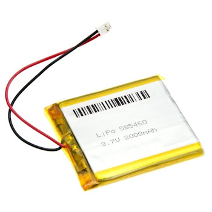

# Weatherstation

This project was born out of a desire to compare the indoor temperature of my home office with the outside temperature over the course of a 24 hour period. This data would provide a way of evaluating the effectiveness of the insulation used in the construction of the home office. This high level goal led to the following requirements:

## Requirements

  * Two separate temperature sensors which can be located independent of each other and not require any physical connection between the two.
  * Ability to view the data from any location on any internet connected device with a web browser such as a mobile phone, laptop, etc.
  * Full control and ownership of the data collected.
  * No ongoing fees to store or access the data.
  * Ability to graph the indoor and outdoor temperature readings over a 24 hour period in a way that is easy to compare the different rates of change and minimum and maximum readings.

These requirements led to the following design:

## Design

  * Use of a Raspberry Pi Pico W running MicroPython, coupled with a BME280 Atmospheric Sensor.
  * Use of a SSD1306 OLED display for displaying the current indoor and outdoor temperature on the indoor unit.
  * Use of a 2000Ah LiPo battery to power the outdoor sensor.
  * Periodic (e.g. every 60 seconds) reading of the sensor and upload to AWS Timestream for storage of time-series data in the cloud.
  * Periodic (e.g. every 60 seconds) download of the latest outdoor sensor reading from AWS Timestream for display on the indoor display.
  * Use of a NTP time server to retrieve the current time and set the Pico's real time clock.
  * Use a GCP timezone server to automatically calculate the local time, adjusting for daylight saving.
  * Enter 'deepsleep' mode between readings to conserve battery power for the outdoor sensor.
  * Periodic cycling (every 5 secods) of the indoor display to alternatively show the indoor temperature and the outdoor temperature.
  * Graphing of the latest 24 hour period of the indoor and outdoor temperature readings using Grafana Cloud. 
  * Catch and upload exceptions to AWS Timestream to aid in debugging of sensor units running in the field without a display or debug port attached.

## Connecting to the Internet
The first thing we need is a means of connecting to and disconnecting from the Internet (or more accurately your WiFi network which in turn provides access to the Internet). This is relatively trivial using the Pico W and MicroPython. MicroPython provides a `network` module which contains a [WLAN](https://docs.micropython.org/en/latest/library/network.WLAN.html) class. To establish a connection you need to:  

  1. Create an instance of the WLAN class.
  1. Activate the connection. If the WiFi radio has been turned off, wait for it to be activated (e.g. 3 seconds).
  1. Initiate a connection, supplying your local WiFi _SSID_ and _password_.
  1. Perodically poll the status of the connection until `isconnected()` returns true.

For this application, being able to disconnect and turn off the WiFi radio is vital when it comes to conserving power when running on battery. To disconnect you need to:  

  1. Disconnect the connection
  1. Deactivate the connection
  1. Turn off the WiFi radio (using `deinit()`)
  1. Release the WLAN class instance.

Code to `connect()` and `disconnect()` can be found in [connection.py](connection.py).

## Managing Settings and Secrets

This application uses _settings_ to configure its behaviour and _secrets_ to connect to the Internet and various services.  

  * Settings are safe to make public and can be stored in a git repository. Settings include things such as the sensor's name, how often readings are taken, whether it should deep sleep between readings, etc.
  * Secrets should be kept private and never stored in a git repository. Secrets include things such as your WiFi SSID and password, AWS access keys and Google API key.

Settings are stored in [settings.py](settings.py) and secrets are stored in `secrets.py`. You will note that there is no `secrets.py` checked into this repository. Instead there is a [secrets_template.py](secrets_template.py) which contains blank entries for each secret setting you will need. If you want to use this code, once you've cloned the repository, you will need to copy `secrets_template.py` to a local `secrets.py` file and fill in your own data. Do not check in `secrets.py` into your own repository. I've added `secrets.py` to the `.gitignore` but you will still need to be careful.

### Common Settings and Sensor-specific Settings

For this application, I wanted to have at least two sensors. An indoor sensor with a display and an outdoor sensor with a battery but no display. I found that some settings were common to both sensors and a few settings were specific to each individual sensor. Common settings included things like the frequency at which sensor readings are taken, the AWS region to use, the timezone location, etc. example. Sensor-specific settings included the sensor name, whether a deep sleep should be performed, etc.

Common settings are stored directly in [settings.py](settings.py). Sensor-specific settings are stored in a json file with a filename format `settings_[location].json` where `[location]` varies for each sensor. When the `settings.py` module is imported, it looks in the root filesystem for the first file it finds with a `settings_` prefix. It then loads the sensor-specific settings from this json file. When deploying the code to a specific sensor, I just deploy the appropriate `settings_[location].json` file to the sensor. This allows me to maintain individual settings for each sensor in the git repository.

## Time

When uploading time series data, it's important to have an accurate time source. The Raspberry Pi Pico does not have a battery backed clock. This means the time has to be set every time it's powered on. However this is not a problem for the Pico W which can connect to the internet. [Network Time Protocol (NTP)](https://en.wikipedia.org/wiki/Network_Time_Protocol) has been around as long as the internet. It allows any network connected device to synchronise its time to [Coordinated Universal Time (UTC)](https://en.wikipedia.org/wiki/Coordinated_Universal_Time).  
The first thing the Weatherstation application does once it's established a connection is to get the current UTC time from an NTP server and set the real time clock. It uses the NTP server specified by `settings.ntp_time_server`. Given time is so critical to this application, it will not continue until it has received a valid time.  
Once the time has been set, it periodically (i.e. every 30 minutes as specified by `settings.sync_time_period_m`) resynchronises with the NTP time server.

### Local Time

To display the current time adjusted for your local timezone you need to determine your offset from UTC time. This is based on your geographic location and whether daylight savings time is in effect.  
One option is to hardcode your local timezone offset and daylight savings start and end dates. However daylight savings can vary from year to year and sometimes gets adjusted based on special events (e.g. Sydney Olympics).  
Rather than try and maintain this information, there are a number of online services which provide the current timezone offset (including daylight savings adjustment). I used the [Google Maps Time Zone API](https://developers.google.com/maps/documentation/timezone/overview) as it is very simple to use (requires a single http request) and is free.  

Time-related functions can be found in [ntptime.py](ntptime.py).

## Periodic Sensor Readings

I am using the [BME280 Atmospheric Sensor](https://core-electronics.com.au/piicodev-atmospheric-sensor-bme280.html) to read temperature, humidity and barometric pressure.  

  

Currently I'm only using the temperature reading. The Weatherstation application takes a reading every minute on the minute. The reading period is specified in `settings.sensor_read_period_s` and is currently set to 60 seconds. Once the readings have been taken, they are displayed locally (if a display is attached) and uploaded to the cloud.

## Uploading Readings to the Cloud

I selected the [AWS Timestream Database](https://aws.amazon.com/timestream/) to store the sensor readings. This service is specifically designed for storing large quantities of time series data in a very efficient manner. It's probably overkill for the amount of data I need to upload but it is a very simple solution.  
I elected to upload the data directly using the Timestream API rather than routing MQTT messages through to the Timestream service.  
Using MicroPython to perform this task required a couple of additional hoops to be jumped through.

  1. All requests to an AWS APIs must be signed. There is example python code provided by Amazon which I was able to modify for my use (see [aws_auth.py](aws_auth.py)). In order to sign a request, the HMAC hashing algorithm must be used. This is not supported by MicroPython but is available in regular Python. I have copied the source file and trimmed it down a bit to run on MicroPython (see [hmac.py](hmac.py))
  1. The Timestream service employs a dynamic host pattern to help with load balancing. This means that before you can make a request to the Timestream service, you must first determine which endpoint is available to service the request in your region. You must send a request to describe the endpoints for your particular request type (query or ingest) which will then return a list of valid endpoints. You can then send your actual request to one of the provided endpoints. Each endpoint includes a time period for which it will remain valid. It allows you to use the endpoint until the time period expires, at which point you must make anothe request to describe the available endpoints. I simplified the behaviour of my code to always request the endpoint for every request. This is not very efficient if you are making hundreds or thousands of requests a second but given I make at most two requests a minute, this is not a consideration.

The final piece of the puzzle, which is not specific to MicroPython, is the need to provide credentials to the AWS service. This is done by providing an `aws_access_key` and `aws_secret_access_key` stored in `secrets.py` (see [secrets_template.py](secrets_template.py)). These keys can be generated by logging into your AWS account and generating keys with permission to access your Timestream service. To follow good security practices, you should only grant access to the Timestream service and not more general permissions to other AWS services.

The code for uploading readings to the cloud can be found in [timestream.py](timestream.py).

## Error Logging

For small, embedded devices which are designed to run continuously, it's important to have a way of logging errors when things go wrong. If the device has limited local storage and is connected to the cloud, it makes sense to upload these error logs to the cloud. This has the advantage of being able to monitor the device remotely or monitor many devices from a single, remote location.

For this application, I've implemented a very simple error logging strategy (see [log.py](log.py)). My main() method has a top-level exception handler which catches all unhandled exceptions. Whenever an unhandled exception is caught, the following steps occur:

  1. The error, including the stack trace is written to a local file.
  1. The error is displayed on the OLED screen (if attached).
  1. The connection to the network is closed.
  1. The Pico Pi is rebooted (this can be disabled when debugging locally).
  1. On startup, the application will check to see an error log file exists and if it does, once the connection has been established, the error is uploaded to the Timestream service and stored in the _DeviceLog_ table.

This allows me to easily view any errors which have been uploaded by my devices and stored in the _DeviceLog_ table.

## The Display

For the office temperature sensor I wanted to use a SSD1306 OLED display so I could monitor the current temperature at a glance. I ended up displaying the current time, temperature and location. 

  

I cycle the display between the indoor office temperature and the outside temperature every 5 seconds.  

  

The default built in font is very small at 8x8 pixels. In order to create something that was visible to my aging eyes, I created a 'packed font' format that allows you to store just the characters you need for a particular application. For this application I created a 16 pixel font for the time and location and a 32 pixel font for the temperature. Both fonts are proportional width fonts which is necessary for decent looking text once the font sizes become larger. I have created a separate project [Packed Fonts for MicroPython](https://github.com/mark-gladding/packed-font/tree/main) which has more details and some font conversion tools.

## Viewing Remote Sensor Readings

To view the outside temperature on the office temperature sensor display, I periodically download the latest outside temperature from the AWS Timestream database. It uses the same code as used to upload readings to the cloud (see [timestream.py](timestream.py)), except instead of using the _ingest_ endpoint to write a series of records, its uses the _query_ endpoint to perform a query to retrieve the most recent temperature reading for the outside temperature sensor.  

The behaviour to query a remote sensor can be configured using the `remote_sensor_location` setting found in the `settings_[location].json` files. You will notice the [settings_office.json](settings_office.json) has the entry `"remote_sensor_location" : "outside"` and [settings_outside.json](settings_outside.json) has the entry `"remote_sensor_location" : null`. To periodically query a remote sensor, specify the sensor name. To disable querying a remote sensor, set the `remote_sensor_location` to `null`.

## Running On Battery Power

I wanted to be able to run the outside sensor on battery power, mainly so I wouldn't be constrained in locating the sensor near a power outlet or need to worry about running a power cable. I set a goal of being able to run the unit for at least a couple of weeks without needing to recharge the battery. Ideally the battery would last over a month.  

My first attempt was to use a 5000mAh Power Bank. The Power Bank was attractive because it was relatively cheap, had a good capacity, was quite small in size and had a built in USB charger. 

  

This worked really well for about a couple of minutes, at which point, power was lost to the Pico. After a bit of research I discovered that Power Banks will automatically switch themselves off when they detect the device they are charging is no longer drawing power. This ensures the Power Bank doesn't drain itself when not in use (when in use they need to actively convert from 3.3v up to 5v which uses some power even if there is nothing plugged in). Unfortunately the Pico Pi W has such a low power draw, the Power Bank does not detect it's present and will switch itself off. 

To get around this, I wondered if I could periodically draw a spike of power which would signal to the Power Bank there was a device still plugged in and prevent it from powering off. I found this was possible by toggling the WiFi connection on and off every 15 seconds or so. This would keep the Power Bank I was using from switching off. Unfortunately this uses quite a bit of power. I was only able to get about 2 days of running time out of the 5000 mAh Power Bank. It was also not completely reliable. Occassionally the Power Bank would still switch itself off.

My next step was to use a plain LiPo battery. I purchased the following [2000 mAh battery](https://core-electronics.com.au/polymer-lithium-ion-battery-2000mah-38459.html) from Core Electronics.

  

This will plug directly into a [PiicoDev LiPo Expansion Board](https://core-electronics.com.au/piicodev-lipo-expansion-board-for-raspberry-pi-pico.html)

In order to conserve power while running on battery, I wanted to put the Pico W to sleep between readings. The idea was to take a reading, upload it to AWS Timestream and then sleep until the next reading was due. There is a lot of information on the internet about how you can or cannot place the Pico W into a deepsleep to conserve power. I can report that it is possible but it's not as straightforward as it should be.  

  1. In order to conserve power, you must power off the WiFi connection first. This requires calls to `WLAN.disconnect()`, `WLAN.active(False)` and `WLAN.deinit()`. The final call to `deinit()` turns off the WiFi radio. See [connection.py](connection.py) for details.
  1. You can then call `machine.lightsleep()` and specify the number of milliseconds to sleep.
  1. There is a bug in the the latest release of MicroPython (v.1.20) which causes `machine.lightsleep()` to return immediately on a Pico Pi W when the WiFi is off. You need to apply the following patch [ports/rp2: fix lightsleep while wifi is powered off](https://github.com/micropython/micropython/pull/10803) to get this to work. I have built MicroPython (v1.20) with this patch applied and made the firmware image available here [firmware.uf2](firmware.uf2) if you don't want to go to the trouble of building MicroPython from source. Note this firmware image is specific to the Pico Pi W.

Having done all this I was able to run the Pico W for about a week off a fully charged 2000 mAh battery. This was not really good enough, so I started looking for some ways of saving power.  

The biggest use of power is the WiFi radio, so to reduce power usage I needed to cut down how long the WiFi radio was on. 

  1. Rather than turn on the WiFi radio and upload a reading every minute, I continue to take a sensor reading every minute but only turn on the WiFi radio every 5 readings. This reduces the WiFi radio usage by 80%, with the only downside being the latest temperature reading from the outside sensor may lag by up to 5 minutes.
  1. To further reduce WiFi radio usage, I introduced a 'night mode'. Between the hours of 10PM and 5AM (this is configurable in settings, see [settings_outside.json](settings_outside.json)), I reduced the upload frequency from every 5 minutes to every 30 minutes. The reasoning being, on most nights I'm not going to be awake to observe these readings, so the time delay is not going to be an issue.

Given all these changes, I have been running the outside sensor for over two weeks now and I expect it should last at least a month.

## Enclosures

For the outside sensor, I've used a small lunchbox container. I drilled a few small holes in the end wall under the lid flap. This ensures the temperature, humidity and barometric pressure inside the container closely matches the outside conditions.

  

The enclosure for the indoor sensor with the display is still a work in progress. At the moment the indoor sensor sits on my desk without any enclosure.

## Graphing Data

To graph the last 24 hours of data and compare the indoor temperature of my office with the outside temperature, I used [Grafana Cloud](https://grafana.com/products/cloud/). Grafana is very simple to set up and offers a free tier which doesn't have any limitations for this application. It natively supports reading of data from an AWS Timestream database. The graphs at the top of the page were created using Grafana.

## Future Enhancements

I'm pretty happy with the results of this project but there are a few future enhancements I'd like to complete.  

  1. Complete an enclosure for the indoor temperature sensor.
  1. Calculate and display some more temperature statistics such as daily, weekly, monthly minimum, average and maximum temperatures.
  1. Support over the air software updates. At the moment with only two sensors this is not a major inconvenience. However if I want to add more sensors in different rooms in the house, it would be nice to be able to deploy software updates via the cloud.

